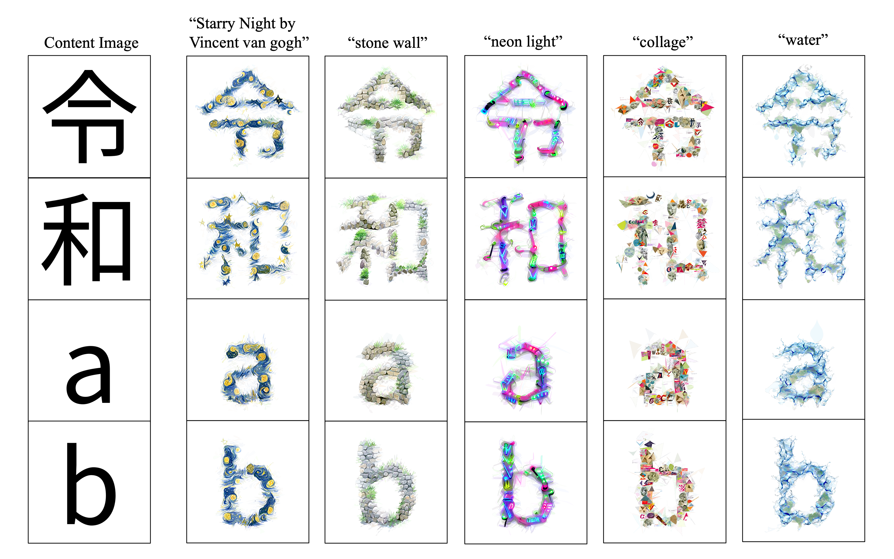

# CLIPFontDraw: Stylizing Fonts with CLIP
- This method revisits the approach from our previous research outlined below and includes additional experiments.
- [Zero-shot Font Style Transfer with a Differentiable Renderer](https://dl.acm.org/doi/10.1145/3551626.3564961)



<br><br>

We provided colab notebook :[](https://colab.research.google.com/drive/1vxDVb_JkNGklfDNToWdyNrRy4S4PtKTD?usp=sharing).

### Environment 
```
$ conda create -n font python=3.9
$ conda activate font
$ conda install pytorch==1.11.0 torchvision==0.12.0 torchaudio==0.11.0 cudatoolkit=11.3 -c pytorch

$ git clone https://github.com/Squ602/Font_Style_Transfer.git
$ cd Font_Style_Transfer
$ pip install -r requirements.txt
$ cd ..
```

#### Install diffvg
The cmake command is required to install diffvg. If you do not have it, follow the steps below to install it.
```
$ wget https://github.com/Kitware/CMake/releases/download/v3.23.2/cmake-3.23.2.tar.gz
$ cd cmake-3.23.3
$ ./configure --prefix=$HOME
$ make
$ make install
```
After the installation is complete, check it with the following command.
```
$ cmake --version
```
Finally, install diffvg.
```
$ git clone https://github.com/BachiLi/diffvg.git
$ cd diffvg
$ git submodule update --init --recursive
$ python setup.py install 
```

#### Install CLIP
```                                   
$ pip install git+https://github.com/openai/CLIP.git --no-deps
```

### Font style transfer
Plase save the font file in `./font-file` directory. (For example, font files can be downloaded [here](https://fonts.google.com/).)
Then, run the command
```
$ cd Zero-shot-font
$ python style_transfer.py --text ST --prompt "Starry Night by Vincent van gogh"
```
