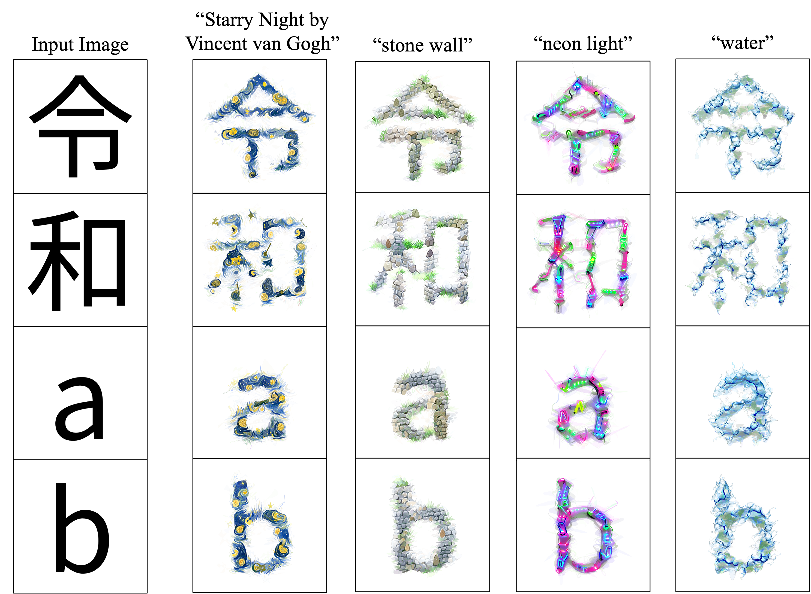

# Zero-shot Font Style Transfer with a Differentiable Renderer



<br><br>

We provided colab notebook : []

### Environment
Pytorch 1.10.1, Python 3.7
```
$ pip install -r requirements.txt

$ cd Font_Style_Transfer
$ git clone https://github.com/BachiLi/diffvg
$ cd diffvg
$ git submodule update --init --recursive
$ python setup.py install         

$ cd ..
$ pip install git+https://github.com/openai/CLIP.git --no-deps
```

### Font style transfer
Plase save the font file in `./font-file` directory. (For example, font files can be downloaded [here](https://fonts.google.com/).)
Then, run the command
```
python style_transfer.py --text ST --prompt "Starry Night by Vincent van gogh"
```
